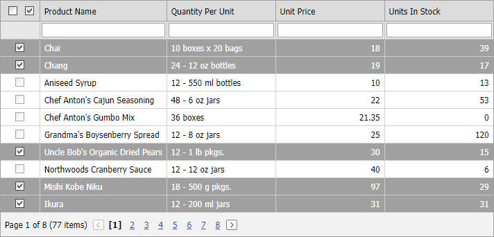

<!-- default badges list -->

<!-- default badges end -->

# Grid View for ASP.NET Web Forms - How to select all rows except disabled rows on the client side
<!-- run online -->
**[[Run Online]](https://codecentral.devexpress.com/e3996/)**
<!-- run online end -->

Client-side [SelectAllRowsOnPage](https://docs.devexpress.com/AspNet/js-ASPxClientGridView.SelectAllRowsOnPage) and [SelectRows](https://docs.devexpress.com/AspNet/js-ASPxClientGridView.SelectRows) methods change the selection state of disabled checkboxes. 

This example illustrates how to implement **Select All** checkboxes that change the selection state of enabled checkboxes only. To do this, you should select each row in a cycle.

## Files to Review

* [Default.aspx](./CS/WebSite/Default.aspx) (VB: [Default.aspx](./VB/WebSite/Default.aspx))
* [Default.aspx.cs](./CS/WebSite/Default.aspx.cs) (VB: [Default.aspx.vb](./VB/WebSite/Default.aspx.vb))
* [JScript.js](./CS/WebSite/Scripts/JScript.js) (VB: [JScript.js](./VB/WebSite/Scripts/JScript.js))

## Online Demo

* [Grid - Select All Rows](https://demos.devexpress.com/ASPxGridViewDemos/Selection/AdvancedSelection.aspx)
